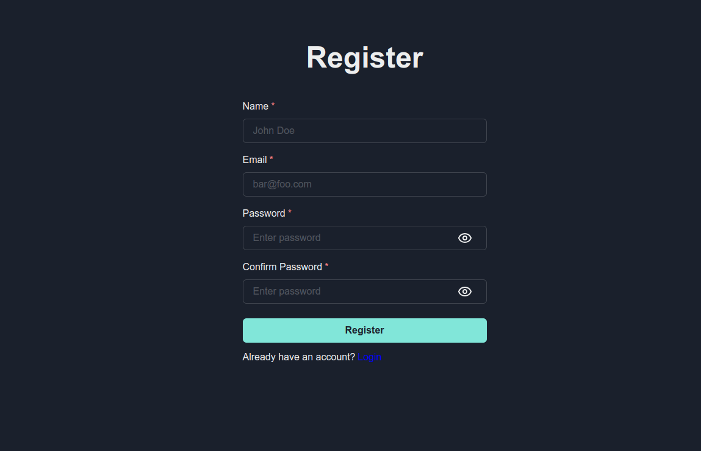
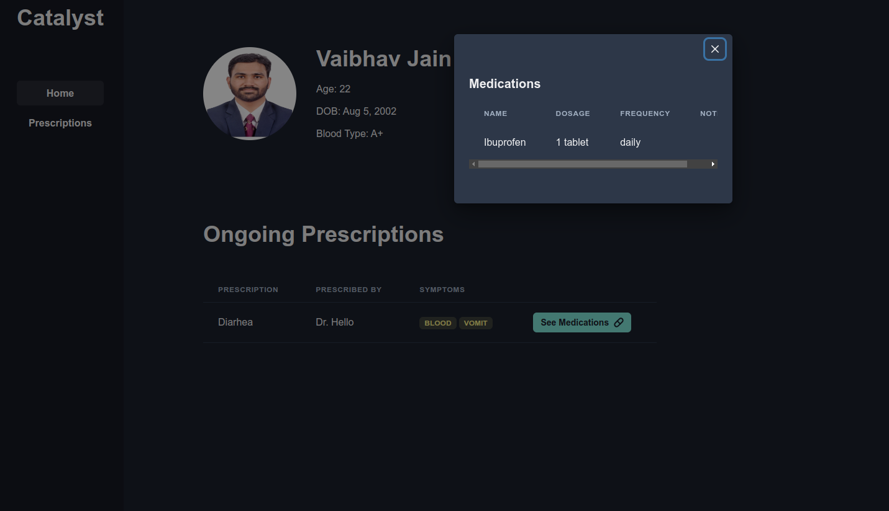

# Patient Dashboard

This project is a simple patient dashboard application built with the Catalyst framework, featuring a user friendly interface built with ChakraUI and a backend built with Supabase. The app is features a dashboard where a patient can track their prescriptions and appointments and timely reminders.

### Technology Stack

- Catalyst
- ChakraUI
- Supabase

## Development Setup

Commence development by initiating the the following commands:

For running the application in development mode, run:

```bash
npm run dev
```

For a production build, change NODE_ENV to "production" in config/config.json, then run :

```bash
npm run build
```

To serve the production build, execute:

```bash
npm run start
```

## Documentation


# Demo

## Login Page

## Login Form Validation

## Register Page

## Register Form Validation

## Dashboard


## Prescriptions Page


## Profile Page

